# GOAT Hackathon Work Graph

## Root
`GOAL-000` Prepare idea-agnostic hackathon base
Status: `done`
Done when: event context, idea workflow, build runbooks, local skills, templates, and validation evidence exist.
Stop when: a task requires external account action, a secret, a wallet operation, a form submission, or app code before the idea is chosen.

`GOAL-100` Build ClawCompass demo-ready capability broker
Status: `review`
Done when: docs, local backend, tests, demo flow, guardrails, payment-gated execution, local reputation, and external proof checklist are ready.
Stop when: creating wallets, submitting forms, mutating ClawUp, spending funds, registering on-chain, or claiming unverified on-chain reputation would be required.

## Top-Down Graph

```mermaid
flowchart TD
  GOAL["GOAL-000 Prepare idea-agnostic hackathon base"]
  E100["EPIC-100 Event constraints and judging gates"]
  E200["EPIC-200 Idea intake and selection workflow"]
  E300["EPIC-300 ClawUp and GOAT build runbooks"]
  E400["EPIC-400 ERC-8004 mainnet registration path"]
  E500["EPIC-500 x402 readiness path"]
  E600["EPIC-600 Demo and submission readiness"]
  G100["GOAL-100 Build ClawCompass demo-ready capability broker"]
  E110["EPIC-110 Idea acceptance and docs graph"]
  E120["EPIC-120 ClawUp shell"]
  E130["EPIC-130 Backend capability broker"]
  E140["EPIC-140 x402 paid execution"]
  E150["EPIC-150 ERC-8004 identity and reputation"]
  E160["EPIC-160 Guardrails and security"]
  E170["EPIC-170 Demo and validation"]
  GOAL --> E100 --> T110["TASK-110 Context doc"]
  GOAL --> E200 --> T210["TASK-210 Idea intake doc"]
  GOAL --> E300 --> T310["TASK-310 Build runbook"]
  GOAL --> E400 --> T410["TASK-410 Registration guidance"]
  GOAL --> E500 --> T510["TASK-510 Payment readiness guidance"]
  GOAL --> E600 --> T610["TASK-610 Demo and submission doc"]
  G100 --> E110
  G100 --> E120
  G100 --> E130
  G100 --> E140
  G100 --> E150
  G100 --> E160
  G100 --> E170
```

## Node Register
| ID | Kind | Status | Owner Surface | Acceptance | Verification | Next Action |
|---|---|---|---|---|---|---|
| GOAL-000 | goal | done | `docs/`, `skills/`, `memory.md` | Future agent can continue after idea selection. | Validate docs, JSON, skills, secrets, and file sizes. | Select idea. |
| EPIC-100 | epic | done | `docs/hackathon/CONTEXT.md` | Event rules and judging gates are captured with source links. | Review context doc against source list. | Use during demo planning. |
| TASK-110 | task | done | `docs/hackathon/CONTEXT.md` | Schedule, links, support contacts, gates, and scorecard summary exist. | Markdown scan and source link review. | Keep updated if event guidance changes. |
| EPIC-200 | epic | done | `docs/hackathon/IDEA-INTAKE.md` | Idea can be evaluated before app work starts. | Intake fields cover problem, market, gap, data, GOAT fit. | Fill idea brief. |
| TASK-210 | task | done | `docs/templates/idea-brief.md` | Template produces a sharp, buildable idea brief. | Manual review against judging criteria. | Choose one candidate idea. |
| EPIC-300 | epic | done | `docs/hackathon/BUILD-RUNBOOK.md` | ClawUp build path is documented without secrets. | Runbook lists non-mutating setup checks and external actions. | Create ClawUp agent after idea selection. |
| TASK-310 | task | done | `skills/clawup-agent-build/SKILL.md` | Future agent knows when to use ClawUp flow. | Skill validator and frontmatter scan. | Use during ClawUp setup. |
| EPIC-400 | epic | done | `skills/erc8004-mainnet-registration/SKILL.md` | Registration workflow separates planning from on-chain action. | Secret scan and skill validation. | Register only after explicit approval. |
| TASK-410 | task | done | `docs/templates/agent-registration.json` | Metadata template avoids secrets and supports 8004scan verification. | JSON validity check. | Fill public metadata. |
| EPIC-500 | epic | done | `skills/x402-payment-readiness/SKILL.md` | x402 is routed only when the idea transacts or monetizes. | Review DIRECT/DELEGATE decision criteria. | Decide payment scope after idea selection. |
| TASK-510 | task | in_progress | app code | x402 flow is implemented and demoable if selected. | Live payment or controlled test evidence. | Local gate done; real merchant blocked. |
| EPIC-600 | epic | done | `docs/hackathon/DEMO-SUBMISSION.md` | 2-minute demo and final checklist are available. | Manual read-through against scorecard. | Rehearse after build. |
| TASK-610 | task | done | `docs/templates/demo-script.md` | Demo script fits the judging flow. | Time-boxed dry run after agent exists. | Fill script after build. |
| GOAL-100 | goal | review | `docs/hackathon/clawcompass/`, app code | ClawCompass loop works locally and external proof blockers are explicit. | Tests, route checks, secret scan, demo rehearsal. | External ClawUp/x402/ERC-8004 actions require user approval. |
| EPIC-110 | epic | done | `docs/hackathon/clawcompass/`, graph | Idea brief and docs hub exist. | Markdown/JSON validation. | Keep docs linked as implementation changes. |
| TASK-111 | task | done | `docs/hackathon/clawcompass/IDEA-BRIEF.md` | ClawCompass accepted as selected idea. | Rubric review against idea intake. | Use for build. |
| TASK-112 | task | done | `docs/codex/work/`, `memory.md` | Work graph and memory track ClawCompass. | JSON parse and manual graph review. | Update after external proof steps. |
| EPIC-120 | epic | blocked | ClawUp UI, Telegram | ClawUp agent exists and Telegram responds. | Manual Telegram round trip. | Requires explicit user action. |
| TASK-121 | task | blocked | ClawUp UI | ClawUp agent exists. | ClawUp dashboard. | Requires explicit user action. |
| TASK-122 | task | blocked | Telegram, ClawUp UI | Telegram bot responds through ClawUp. | Manual Telegram round trip. | Requires BotFather and pairing. |
| TASK-123 | task | done | Claw prompt/docs | `/help`, `/ask`, `/use`, `/security` wording is ready. | Demo script and API responses. | Use responses in ClawUp. |
| EPIC-130 | epic | done | app code | Marketplace, analyzer, sanitizer, ranker, API routes work. | Unit and API tests. | Use local routes in demo. |
| TASK-131 | task | done | app data | Seed capabilities exist. | `/api/marketplace`. | Replace demo inventory later. |
| TASK-132 | task | done | app services | Task classifier works. | Unit tests. | Expand semantic routing later. |
| TASK-133 | task | done | app services | Context sanitizer redacts secrets. | Unit/API tests. | Expand classifiers later. |
| TASK-134 | task | done | app services | Ranker returns top 3 and sequence. | Unit/API tests. | Replace heuristic scoring later. |
| EPIC-140 | epic | blocked | app code, x402 external | Paid tools are blocked until verified payment. | Payment state tests and route checks. | Real merchant setup required. |
| TASK-141 | task | done | app services | Transaction states cover quote, approval, settlement, delivery, cancel, retry. | Unit/API tests. | Connect real x402 later. |
| TASK-142 | task | blocked | x402 merchant | Real x402 route verifies payment. | Real payment evidence. | Requires merchant/funds. |
| TASK-143 | task | done | app executor | PitchHawk executes after verified payment. | API test. | Use in demo route check. |
| EPIC-150 | epic | blocked | GOAT mainnet, app reputation | ERC-8004 identity is live; local reputation logs work. | 8004scan plus API tests. | Local logging first; on-chain blocked. |
| TASK-151 | task | blocked | wallet, funding | Public address and balances recorded without secrets. | Balance check. | Requires explicit user action. |
| TASK-152 | task | blocked | GOAT mainnet, 8004scan | ClawCompass appears on 8004scan. | Mainnet tx and URL. | Requires wallet/gas/approval. |
| TASK-153 | task | done | app reputation | Reputation event links transaction and outcome. | `/api/reputation/PitchHawk`. | Wire on-chain later. |
| EPIC-160 | epic | done | app guardrails | High-risk, paid, write, wallet, external actions require approval. | Unit/API tests. | Show in demo. |
| TASK-161 | task | done | app guardrails | Approval matrix works. | Unit tests. | Show risky prompt. |
| TASK-162 | task | done | app transactions | Audit log shows transactions cleanly. | `/api/transactions`. | Persist later if needed. |
| EPIC-170 | epic | done | docs, tests, local server | Demo path and submission evidence are ready. | Timed rehearsal and validation. | Use script during live ClawUp setup. |
| TASK-171 | task | done | tests, local server | Local demo path validates. | Route checks and scans. | Repeat after external setup. |

## Status Notes
- Required preparation nodes are `done`.
- ClawCompass local backend, docs, route checks, and validation are `done`.
- External ClawUp, Telegram, wallet, merchant, funding, and ERC-8004 nodes remain `blocked` until explicit user action.

## Validation Evidence
Validated on 2026-05-26:
- `python3 -m json.tool docs/codex/work/work-items.json`
- `python3 -m json.tool docs/templates/agent-registration.json`
- Unresolved marker scan returned no matches.
- Secret-pattern scan returned no matches.
- `find AGENTS.md memory.md docs skills -type f -name '*.md' -exec wc -l {} +` showed all authored Markdown files under 300 lines.
- `quick_validate.py` reported all four local skills valid.

Validated ClawCompass local build on 2026-05-26:
- `npm run validate` passed with 14 tests.
- `npm audit --audit-level=moderate` reported 0 vulnerabilities.
- `python3 -m json.tool` passed for work graph, registration metadata, and capability seed JSON.
- Secret scan, excluding the sanitizer regex definition, returned no matches.
- Local route check proved help, ask, redaction, unpaid 402 block, demo settlement, PitchHawk delivery, security policy, and reputation update.
