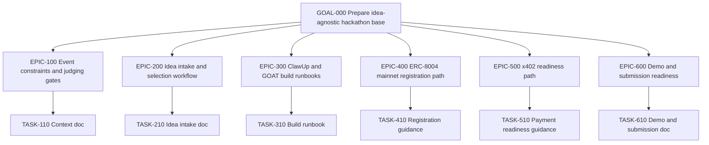

# GOAT Hackathon Work Graph

## Root
`GOAL-000` Prepare idea-agnostic hackathon base  
Status: `done`  
Done when: event context, idea workflow, build runbooks, local skills, templates, and validation evidence exist.  
Stop when: a task requires external account action, a secret, a wallet operation, a form submission, or app code before the idea is chosen.

## Top-Down Graph

## Node Register
| ID | Kind | Status | Owner Surface | Acceptance | Verification | Next Action |
|---|---|---|---|---|---|---|
| GOAL-000 | goal | done | `docs/`, `skills/`, `memory.md` | Future agent can continue after idea selection. | Validate docs, JSON, skills, secrets, and file sizes. | Select idea. |
| EPIC-100 | epic | done | `docs/hackathon/CONTEXT.md` | Event rules and judging gates are captured with source links. | Review context doc against source list. | Use during demo planning. |
| TASK-110 | task | done | `docs/hackathon/CONTEXT.md` | Schedule, links, support contacts, gates, and scorecard summary exist. | Markdown scan and source link review. | Keep updated if event guidance changes. |
| EPIC-200 | epic | done | `docs/hackathon/IDEA-INTAKE.md` | Idea can be evaluated before app work starts. | Intake fields cover problem, market, gap, data, GOAT fit. | Fill idea brief. |
| TASK-210 | task | done | `docs/templates/idea-brief.md` | Template produces a sharp, buildable idea brief. | Manual review against judging criteria. | Choose one candidate idea. |
| EPIC-300 | epic | done | `docs/hackathon/BUILD-RUNBOOK.md` | ClawUp build path is documented without secrets. | Runbook lists non-mutating setup checks and external actions. | Create ClawUp agent after idea selection. |
| TASK-310 | task | done | `skills/clawup-agent-build/SKILL.md` | Future agent knows when to use ClawUp flow. | Skill validator and frontmatter scan. | Use during ClawUp setup. |
| EPIC-400 | epic | done | `skills/erc8004-mainnet-registration/SKILL.md` | Registration workflow separates planning from on-chain action. | Secret scan and skill validation. | Register only after explicit approval. |
| TASK-410 | task | done | `docs/templates/agent-registration.json` | Metadata template avoids secrets and supports 8004scan verification. | JSON validity check. | Fill public metadata. |
| EPIC-500 | epic | done | `skills/x402-payment-readiness/SKILL.md` | x402 is routed only when the idea transacts or monetizes. | Review DIRECT/DELEGATE decision criteria. | Decide payment scope after idea selection. |
| TASK-510 | task | backlog | app code | x402 flow is implemented and demoable if selected. | Live payment or controlled test evidence. | Wait for idea. |
| EPIC-600 | epic | done | `docs/hackathon/DEMO-SUBMISSION.md` | 2-minute demo and final checklist are available. | Manual read-through against scorecard. | Rehearse after build. |
| TASK-610 | task | done | `docs/templates/demo-script.md` | Demo script fits the judging flow. | Time-boxed dry run after agent exists. | Fill script after build. |

## Status Notes
- Required preparation nodes are `done`.
- Idea-specific build and payment implementation remain `backlog`.
- External actions are intentionally not performed in this scaffold.

## Validation Evidence
Validated on 2026-05-26:
- `python3 -m json.tool docs/codex/work/work-items.json`
- `python3 -m json.tool docs/templates/agent-registration.json`
- Unresolved marker scan returned no matches.
- Secret-pattern scan returned no matches.
- `find AGENTS.md memory.md docs skills -type f -name '*.md' -exec wc -l {} +` showed all authored Markdown files under 300 lines.
- `quick_validate.py` reported all four local skills valid.
