# GOAT Hackathon Work Graph

## Root
`GOAL-000` Prepare idea-agnostic hackathon base
Status: `done`
Done when: event context, idea workflow, build runbooks, local skills, templates, and validation evidence exist.
Stop when: a task requires external account action, a secret, a wallet operation, a form submission, or app code before the idea is chosen.

`GOAL-100` Build ClawCompass demo-ready capability broker
Status: `review`
Done when: docs, local backend, tests, demo flow, guardrails, payment-gated execution, local reputation, and external proof checklist are ready.
Stop when: creating wallets, submitting forms, mutating ClawUp, spending funds, registering on-chain, or claiming unverified on-chain reputation would be required.

`GOAL-200` Finish ClawCompass demo-ready full product
Status: `blocked`
Done when: backend alignment, full web app, ClawUp command parity, graph/docs, validation, browser QA, and explicit external-proof blockers are recorded.
Stop when: creating wallets, submitting forms, mutating ClawUp, spending funds, registering on-chain, or sending external messages would be required.

## Top-Down Graph

```mermaid
flowchart TD
  GOAL["GOAL-000 Prepare idea-agnostic hackathon base"]
  E100["EPIC-100 Event constraints and judging gates"]
  E200["EPIC-200 Idea intake and selection workflow"]
  E300["EPIC-300 ClawUp and GOAT build runbooks"]
  E400["EPIC-400 ERC-8004 mainnet registration path"]
  E500["EPIC-500 x402 readiness path"]
  E600["EPIC-600 Demo and submission readiness"]
  G100["GOAL-100 Build ClawCompass demo-ready capability broker"]
  E110["EPIC-110 Idea acceptance and docs graph"]
  E120["EPIC-120 ClawUp shell"]
  E130["EPIC-130 Backend capability broker"]
  E140["EPIC-140 x402 paid execution"]
  E150["EPIC-150 ERC-8004 identity and reputation"]
  E160["EPIC-160 Guardrails and security"]
  E170["EPIC-170 Demo and validation"]
  G200["GOAL-200 Finish ClawCompass demo-ready full product"]
  E210["EPIC-210 Plan graph and source alignment"]
  E220["EPIC-220 Backend broker alignment"]
  E230["EPIC-230 Full web app"]
  E240["EPIC-240 ClawUp and command shell"]
  E250["EPIC-250 x402 and ERC-8004 proof path"]
  E260["EPIC-260 QA, security, and demo rehearsal"]
  GOAL --> E100 --> T110["TASK-110 Context doc"]
  GOAL --> E200 --> T210["TASK-210 Idea intake doc"]
  GOAL --> E300 --> T310["TASK-310 Build runbook"]
  GOAL --> E400 --> T410["TASK-410 Registration guidance"]
  GOAL --> E500 --> T510["TASK-510 Payment readiness guidance"]
  GOAL --> E600 --> T610["TASK-610 Demo and submission doc"]
  G100 --> E110
  G100 --> E120
  G100 --> E130
  G100 --> E140
  G100 --> E150
  G100 --> E160
  G100 --> E170
  G200 --> E210 --> T211["TASK-211 Update graph and docs"]
  G200 --> E220 --> T221["TASK-221 LLM analyzer"]
  E220 --> T222["TASK-222 Autonomous paid flow"]
  E220 --> T223["TASK-223 Payment verification binding"]
  E220 --> T224["TASK-224 ERC-8004 reputation adapter"]
  E220 --> T225["TASK-225 Buyer purchase API"]
  G200 --> E230 --> T231["TASK-231 React shell"]
  E230 --> T232["TASK-232 Broker workflow UI"]
  E230 --> T233["TASK-233 Proof and admin UI"]
  E230 --> T234["TASK-234 Buyer and seller UI"]
  G200 --> E240 --> T241["TASK-241 Command parity"]
  E240 --> T242["TASK-242 Telegram bridge"]
  G200 --> E250 --> T251["TASK-251 External proof capture"]
  G200 --> E260 --> T261["TASK-261 Validation and browser QA"]
  E260 --> T262["TASK-262 Blocker audit"]
  E260 --> T770["TASK-770 Merge om and development"]
```

## Node Register
| ID | Kind | Status | Owner Surface | Acceptance | Verification | Next Action |
|---|---|---|---|---|---|---|
| GOAL-000 | goal | done | `docs/`, `skills/`, `memory.md` | Future agent can continue after idea selection. | Validate docs, JSON, skills, secrets, and file sizes. | Select idea. |
| EPIC-100 | epic | done | `docs/hackathon/CONTEXT.md` | Event rules and judging gates are captured with source links. | Review context doc against source list. | Use during demo planning. |
| TASK-110 | task | done | `docs/hackathon/CONTEXT.md` | Schedule, links, support contacts, gates, and scorecard summary exist. | Markdown scan and source link review. | Keep updated if event guidance changes. |
| EPIC-200 | epic | done | `docs/hackathon/IDEA-INTAKE.md` | Idea can be evaluated before app work starts. | Intake fields cover problem, market, gap, data, GOAT fit. | Fill idea brief. |
| TASK-210 | task | done | `docs/templates/idea-brief.md` | Template produces a sharp, buildable idea brief. | Manual review against judging criteria. | Choose one candidate idea. |
| EPIC-300 | epic | done | `docs/hackathon/BUILD-RUNBOOK.md` | ClawUp build path is documented without secrets. | Runbook lists non-mutating setup checks and external actions. | Create ClawUp agent after idea selection. |
| TASK-310 | task | done | `skills/clawup-agent-build/SKILL.md` | Future agent knows when to use ClawUp flow. | Skill validator and frontmatter scan. | Use during ClawUp setup. |
| EPIC-400 | epic | done | `skills/erc8004-mainnet-registration/SKILL.md` | Registration workflow separates planning from on-chain action. | Secret scan and skill validation. | Register only after explicit approval. |
| TASK-410 | task | done | `docs/templates/agent-registration.json` | Metadata template avoids secrets and supports 8004scan verification. | JSON validity check. | Fill public metadata. |
| EPIC-500 | epic | done | `skills/x402-payment-readiness/SKILL.md` | x402 is routed only when the idea transacts or monetizes. | Review DIRECT/DELEGATE decision criteria. | Decide payment scope after idea selection. |
| TASK-510 | task | done | app code | x402 flow is implemented and demoable if selected. | Live payment or controlled test evidence. | Real merchant settlement remains blocked. |
| EPIC-600 | epic | done | `docs/hackathon/DEMO-SUBMISSION.md` | 2-minute demo and final checklist are available. | Manual read-through against scorecard. | Rehearse after build. |
| TASK-610 | task | done | `docs/templates/demo-script.md`, `docs/hackathon/clawcompass/DEMO-SCRIPT.md`, `docs/presentations/clawcompass_final_judge_demo.pptx` | Demo script and single stage-ready judge deck fit the live demo flow, explain the fixed problem, show tools used, and include mandatory/judging coverage. | Time-boxed dry run after agent exists; final deck includes live-step cues, speaker notes, guardrail, x402, mandatory proof slots, and judging criteria evidence checks. | Use `clawcompass_final_judge_demo.pptx` for the final stage demo rehearsal. |
| GOAL-100 | goal | review | `docs/hackathon/clawcompass/`, app code | ClawCompass loop works locally and external proof blockers are explicit. | Tests, route checks, secret scan, demo rehearsal. | External ClawUp/x402/ERC-8004 actions require user approval. |
| EPIC-110 | epic | done | `docs/hackathon/clawcompass/`, graph | Idea brief and docs hub exist. | Markdown/JSON validation. | Keep docs linked as implementation changes. |
| TASK-111 | task | done | `docs/hackathon/clawcompass/IDEA-BRIEF.md` | ClawCompass accepted as selected idea. | Rubric review against idea intake. | Use for build. |
| TASK-112 | task | done | `docs/codex/work/`, `memory.md` | Work graph and memory track ClawCompass. | JSON parse and manual graph review. | Update after external proof steps. |
| EPIC-120 | epic | blocked | ClawUp UI, Telegram | ClawUp agent exists and Telegram responds. | Manual Telegram round trip. | Requires explicit user action. |
| TASK-121 | task | blocked | ClawUp UI | ClawUp agent exists. | ClawUp dashboard. | Requires explicit user action. |
| TASK-122 | task | blocked | Telegram, ClawUp UI | Telegram bot responds through ClawUp. | Manual Telegram round trip. | Public username found; rotate token if needed and verify ClawUp pairing. |
| TASK-123 | task | done | Claw prompt/docs, app command adapter | `/help`, `/ask`, `/use`, `/security` wording is ready. | Demo script, API responses, command tests. | Use responses in ClawUp. |
| EPIC-130 | epic | done | app code | Marketplace, analyzer, sanitizer, ranker, API routes, and command adapter work. | Unit and API tests. | Use local routes in demo. |
| TASK-131 | task | done | app data | Seed capabilities exist. | `/api/marketplace`. | Replace demo inventory later. |
| TASK-132 | task | done | app services | Task classifier works. | Unit tests. | Expand semantic routing later. |
| TASK-133 | task | done | app services | Context sanitizer redacts secrets. | Unit/API tests. | Expand classifiers later. |
| TASK-134 | task | done | app services | Ranker returns top 3 and sequence. | Unit/API tests. | Replace heuristic scoring later. |
| EPIC-140 | epic | blocked | app code, x402 external | Paid tools are blocked until verified payment. | Payment state tests and route checks. | Real merchant setup required. |
| TASK-141 | task | done | app services | Transaction states cover quote, approval, settlement, delivery, cancel, retry. | Unit/API tests. | Connect real x402 later. |
| TASK-142 | task | blocked | x402 merchant, payment adapter | Real x402 route verifies payment. | Real payment evidence with full env proof (API URL, key, secret, merchant ID, payer wallet). | Requires merchant/funds/explicit approval and full env fields. |
| TASK-143 | task | done | app executor | PitchHawk executes after verified payment. | API test. | Use in demo route check. |
| EPIC-150 | epic | blocked | GOAT mainnet, app reputation | ERC-8004 identity is live; local reputation logs work. | 8004scan plus API tests. | Local logging first; on-chain blocked. |
| TASK-151 | task | blocked | wallet, funding | Public address and balances recorded without secrets. | Balance check. | Requires explicit user action. |
| TASK-142 | task | blocked | x402 merchant, payment adapter | Real x402 route verifies payment. | Real payment evidence with full env proof (API URL, key, secret, merchant ID, payer wallet). | Requires merchant/funds/explicit approval and full env fields. |
| TASK-143 | task | done | app executor | PitchHawk executes after verified payment. | API test. | Use in demo route check. |
| EPIC-150 | epic | blocked | GOAT mainnet, app reputation | ERC-8004 identity is live; local reputation logs work. | 8004scan plus API tests. | Local logging first; on-chain blocked. |
| TASK-151 | task | blocked | wallet, funding | Public address and balances recorded without secrets. | Balance check. | Public address found; private key exposure means funding/use needs explicit decision. |
| TASK-152 | task | blocked | GOAT mainnet, 8004scan | ClawCompass appears on 8004scan. | Mainnet tx, id, and URI. | Requires wallet/gas/approval and explicit on-chain action. |
| TASK-153 | task | done | app reputation | Reputation event links transaction and outcome. | `/api/reputation/PitchHawk`. | Wire on-chain later. |
| EPIC-160 | epic | done | app guardrails | High-risk, paid, write, wallet, external actions require approval. | Unit/API tests. | Show in demo. |
| TASK-161 | task | done | app guardrails | Approval matrix works. | Unit tests. | Show risky prompt. |
| TASK-162 | task | done | app transactions | Audit log shows transactions cleanly. | `/api/transactions`. | Persist later if needed. |
| EPIC-170 | epic | done | docs, tests, local server | Demo path and submission evidence are ready. | Timed rehearsal and validation. | Use script during live ClawUp setup. |
| TASK-171 | task | done | tests, local server | Local demo path validates. | Route checks and scans. | Repeat after external setup. |
| GOAL-200 | goal | blocked | app code, `web/`, docs, graph | Full local product works and external proof blockers are explicit. | Backend tests, web build, browser QA, scans, graph parse. | External proof requires user-approved ClawUp, wallet, merchant, and mainnet actions. |
| EPIC-210 | epic | done | `docs/codex/work/`, `memory.md`, ClawCompass docs | GOAL-200 graph and source alignment are recorded. | Markdown review and JSON parse. | Keep updated after validation. |
| TASK-211 | task | done | graph, memory, docs | GOAL-200 nodes and web/backend interface changes are durable. | Manual graph review plus JSON parse. | Update evidence after final checks. |
| EPIC-220 | epic | done | backend services and API | LLM-first analysis, autonomous within-cap payment, payment binding, and reputation write-state exist. | Unit and API tests. | Connect real credentials only after approval. |
| TASK-221 | task | done | `src/services/taskAnalyzer.ts` | `/api/ask` returns analysis source, model, confidence, fallback reason, and recommended sequence. | Tests cover deterministic fallback without `ANTHROPIC_API_KEY`. | Use real key only from untracked env. |
| TASK-222 | task | done | guardrails, payment quote API | Low-risk paid tools under `0.10 USDC` skip approval but still require x402 payment. | API and unit tests. | Demo through web and command surfaces. |
| TASK-223 | task | done | payment adapter/status API | Payment proof is bound to transaction, capability, amount, token, wallet, chain, expiry, and idempotency. | Binding mismatch test and status API test. | Verify with live x402 only after credentials/funds. |
| TASK-224 | task | done | reputation API/logger | Reputation events expose pending/written on-chain state without false claims. | Reputation tests and `/write-onchain` API test. | Write on-chain only after wallet/registration approval. |
| TASK-225 | task | done | `/api/buy`, buyer flow service | Another agent can submit task/context/budget/risk and receive buyable recommendations plus a payment-bound purchase intent. | API tests cover buyer intent and low-risk budget filtering. | Use `/buy` in browser demo. |
| EPIC-230 | epic | done | `web/` | Browser app exposes every local workflow and proof blocker. | `npm run build:web` and browser QA. | Use during demo rehearsal. |
| TASK-231 | task | done | Vite React shell | Web app routes and API client exist. | Production web build. | Use browser QA. |
| TASK-232 | task | done | homepage, broker/capability/transaction/reputation UI | Homepage presents the judge-critical problem, demo flow, toolchain, scorecard coverage, mandatory gates, proof status, and links into the broker workflow. User can still analyze, quote, settle mock, execute, retry, cancel, and inspect reputation from `/broker`. | `npm run build:web`; Vite served `/` at `http://127.0.0.1:5175/` with HTTP 200. | Use `/` as the stage overview and `/broker` for live workflow execution. |
| TASK-233 | task | done | security/proof UI | User can see guardrails, blocked-risk demo, and external proof checklist. | Web build and browser QA. | Capture screenshot evidence if needed. |
| TASK-234 | task | done | `/buy`, `/sell`, API client | Web app shows both buyer-agent purchase flow and seller marketplace/provider intake flow. | Web build and browser QA on buyer and seller routes. | Re-run after real x402 credentials are added. |
| EPIC-240 | epic | done | command handler, ClawUp text, Telegram bridge | Command outputs match web/backend behavior and optional Telegram polling can route messages when explicitly enabled. | API command tests and Telegram bridge tests. | Wire into ClawUp after external setup; use Telegram bridge only with rotated runtime token. |
| TASK-241 | task | done | `/api/command` | `/help`, `/ask`, `/use`, `/security`, `/transactions`, `/reputation`, `/cancel`, and `/retry` remain usable. | Command adapter tests. | Use in ClawUp/Telegram. |
| TASK-242 | task | done | `src/services/telegramBridge.ts`, `src/index.ts` | Telegram text updates route through the command handler and replies return to the chat; bridge stays disabled unless `TELEGRAM_BOT_ENABLED=true` and a runtime token exist. | `npx vitest run tests/telegramBridge.test.ts` and full validation. | Use only with a rotated token in untracked runtime environment. |
| EPIC-250 | epic | blocked | ClawUp, Telegram, wallet, x402, ERC-8004 | Public proof is captured after explicit user-approved external setup. | Dashboard, payment, tx, and 8004scan evidence. | Requires user action, credentials, wallet, and funds. |
| TASK-251 | task | blocked | public proof docs/API | Capture ClawUp agent ID, Telegram username, wallet address, x402 settlement, ERC-8004 tx hash, and 8004scan URL only. | `/api/proof` plus public evidence review. | Requires external setup approval plus exact missing proof fields from `/api/proof`. |
| EPIC-260 | epic | done | tests, browser, scans, git | Local implementation is verified. | Full validation suite and git status. | Commit/push closeout. |
| TASK-261 | task | done | validation commands, `docs/demo-recordings/` | Backend, frontend, security, docs, browser-visible paths, and transaction demo recording validate. | `npm run validate`, `npm run build:web`, audit, scans, browser QA, and recorded transaction walkthrough. | Repeat after external setup. |
| TASK-262 | task | done | docs/proof safety review | Local blocker audit distinguishes fixed local mock-safety guard from remaining external proof blockers. | Source review of `createPaymentAdapter`, `/api/demo-settle`, and readiness docs. | No local-actionable blockers remain; mock settlement is dev-only behind `ENABLE_MOCK_X402=true`, and real x402 mode rejects mock settlement. | Continue only with user-approved external proof actions. |
| TASK-770 | task | done | root ClawCompass app, web app, command handler, work graph | `om` is merged onto `origin/development` as the integration base, with SetupPilot available through root API, command, payment, dashboard, tests, and docs. | API tests, TypeScript build, web build, JSON validation, audit, route smoke checks, and secret scan. | Push `origin/om` and use root app for demo work. |

## Status Notes
- Required preparation nodes are `done`.
- ClawCompass local backend, docs, route checks, and validation are `done`.
- GOAL-200 local backend and web implementation is `done`, including explicit buyer and seller surfaces; GOAL-200 remains `blocked` only by external proof actions.
- Local blocker audit on 2026-05-26 found no remaining local-actionable blockers; mock x402 settlement is development-only and final proof remains external/live.
- External proof intake found public Telegram, wallet, merchant, and GOAT setup details, but no verified pairing, funding, x402 settlement, ERC-8004 agent ID, registration transaction, or 8004scan listing.
- External ClawUp, Telegram pairing, wallet use/funding, merchant credentials, and ERC-8004 nodes remain `blocked` until explicit user action and verified proof.
- `om` now uses the root `origin/development` app as the integration base; the older nested API scaffold was removed.

## Validation Evidence
Validated on 2026-05-26:
- `python3 -m json.tool docs/codex/work/work-items.json`
- `python3 -m json.tool docs/templates/agent-registration.json`
- Unresolved marker scan returned no matches.
- Secret-pattern scan returned no matches.
- `find AGENTS.md memory.md docs skills -type f -name '*.md' -exec wc -l {} +` showed all authored Markdown files under 300 lines.
- `quick_validate.py` reported all four local skills valid.

Validated ClawCompass local build on 2026-05-26:
- `npm run validate` passed with 19 tests.
- `npm audit --audit-level=moderate` reported 0 vulnerabilities.
- `python3 -m json.tool` passed for work graph, registration metadata, and capability seed JSON.
- Secret scan, excluding the sanitizer regex definition, returned no matches.
- Local route check proved health, help, ask, redaction, approval, unpaid 402 block, mock-only demo settlement, command adapter, PitchHawk delivery, security policy, and reputation update.

Validated GOAL-200 local build on 2026-05-26:
- `npm run validate` passed with 26 tests.
- `npm run build:web` passed.
- `npm audit --audit-level=moderate` reported 0 vulnerabilities.
- JSON parse passed for work graph, capability seed, and registration metadata.
- Secret scan, excluding sanitizer regex definitions and known public/demo addresses, returned no matches.
- Browser QA verified desktop broker flow, buyer purchase flow, seller marketplace/provider flow, support screens, blocked proof states, and a mobile viewport with `innerWidth=390` and `scrollWidth=390`.

Validated `om` plus `origin/development` integration on 2026-05-26:
- `npm run validate` passed with 31 tests.
- `npm run build:web` passed.
- `npm audit --audit-level=moderate` reported 0 vulnerabilities.
- JSON parse passed for work graph, registration metadata, and capability seed data.
- Route and browser smoke verified onboarding analysis, `setuppilot` top recommendation, x402 payment-required quote, mock-local settlement, SetupPilot execution, buyer flow, seller submission, delivered transaction, and 390px mobile layout with no horizontal overflow.

Validated external proof intake on 2026-05-26:
- Sanitized `/Users/shreyapatel/Projects/zzz project docs/GOAT Hack/ClawUp ENV.docx` into `docs/hackathon/clawcompass/EXTERNAL-PROOF-INTAKE.md` without recording secrets.
- Added proof-status tests so public IDs alone do not mark `/api/proof` ready for submission.

Validated transaction QA on 2026-05-26:
- Local mock-payment stack used API `http://127.0.0.1:3308` and web `http://127.0.0.1:5174`.
- In-app browser QA verified SetupPilot recommendation, payment-required quote, unpaid HTTP `402` block with visible UI message, mock settlement, delivered broker transaction, reputation update, buyer transaction delivery, transaction history, and blocked external proof gates.
- Demo recording saved to `docs/demo-recordings/clawcompass-transactions-qa-2026-05-26.webm`; QA note saved to `docs/demo-recordings/TRANSACTION-QA-2026-05-26.md`.

Blocker audit evidence on 2026-05-26:
- Source review confirmed mock settlement is selected only with `ENABLE_MOCK_X402=true`; real x402 mode rejects mock settlement.
- Product-path validation evidence is captured under TASK-261.

Validated Telegram bridge and current local app on 2026-05-26:
- `npx vitest run tests/telegramBridge.test.ts` passed with 2 tests after red-green implementation.
- `npm run validate` passed with 37 tests across 3 files.
- `npm run build:web` passed.
- `npm audit --audit-level=moderate` found 0 vulnerabilities.
- JSON parse passed for work graph, registration metadata, and capability seed data.
- Secret-pattern scan found only the README placeholder command, no saved credential values.
- API `http://127.0.0.1:3310` and web `http://127.0.0.1:5176` browser QA verified SetupPilot analysis, x402 payment-required quote, unpaid execution block, local mock settlement, delivered execution, proof page blockers, and mobile proof layout at `390px` with no horizontal overflow.
- Read-only GOAT RPC check confirmed chain ID `2345`, public wallet balance `0.00001` native gas token, canonical registry code at `0x8004A169FB4a3325136EB29fA0ceB6D2e539a432`, and unverified code at `0xE1AD845D93853fff44990aE0DcecD8575293681e`.
